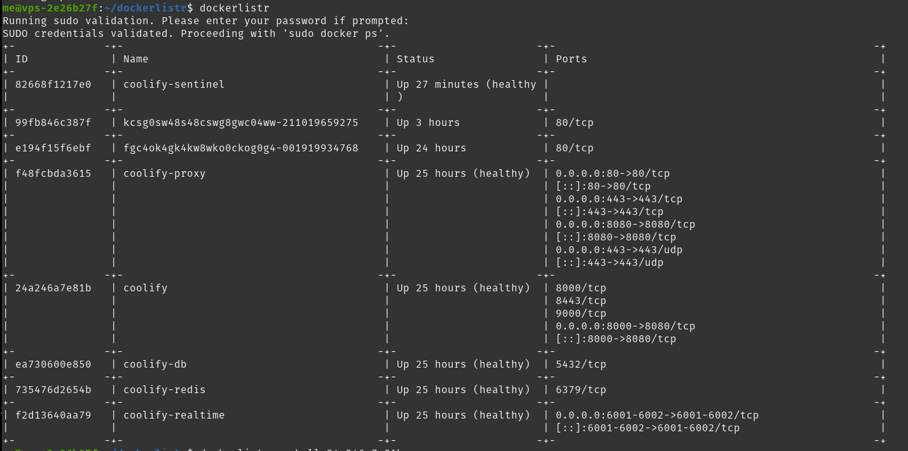

### Info

- Provides a command `dockerlistr` to list running Docker containers with formatted output
- Optionally allows you to open a shell on a specified container
- Optionally allows you to display network statistics for a specified container

### Development / Installation

- Code lives in `/usr/local/bin/dockerlistr` (repo includes a useable .deb file)
- Build a new Debian package with: `dpkg-deb --build dockerlistr-1.0`
- Install with: `sudo dpkg -i dockerlistr-1.0.deb`
- Uninstall with: `sudo dpkg -r dockerlistr`

### Commands

- `dockerlistr`: Lists running Docker containers in a formatted table
- `dockerlistr` --shell <container_id>: Opens a shell in the specified Docker container
- `dockerlistr` --netstat <container_id>: Displays network statistics for the specified Docker container
